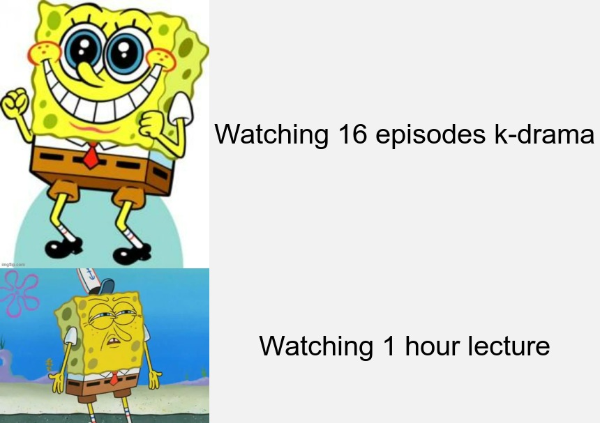

# :question:About My Original Meme

**This meme was inspired by:**
1. *Struggles of a Univeristy student going through online lectures* :computer:
2. *Spongebob because many popular memes on the web are inspired by Spongebob* 
3. *The comfort and laughs from reading memes*:full_moon_with_face:

These inspirations led me to put together an original meme. 

## :bulb: Memes are Fun!
:point_down:Here is the meme I developed using R with the package [{magick}](https://cran.r-project.org/web/packages/magick/vignettes/intro.html).

## Meme Source

The images were sourced from two websites linked below :point_down::

* First row image: *[Happy Spongebob](https://imgflip.com/i/697gxz)*
* Second row image: *[Upset Spongebob](https://imgflip.com/memetemplate/9382656/Angry-Spongebob)*

### Hope you enjoyed the meme!:wave:

